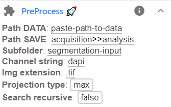

# Preprocessing of 3D images

Segmentation is performed on **2D images**. This plugin allows to obtain 2D images from 3D images either by 
a projection or by saving each z-plane separately. These images are typically stored in a separate folder. 
2D images by applying a projection, and these images are typically stored in a separate folder.

Install ImJoy plugin `PreProcess` <a href="https://imjoy.io/#/app?w=fq-segmentation&plugin=fish-quant/fq-segmentation:PreProcess@stable&upgrade=1" target="_blank">** from here.**</a>

## Recommended workflow

The default settings of the plugins allow to quickly perform the recommended workflow. You only have 
to paste your data folder.  

1. 3D images are stored in a folder `acquisition`
2. In the pre-processing step, the folder to save data is obtained with 
    
    1. the text replacement `acquisition>>analysis`.
    2. Images are stored in a new subfolder `segmentation-input`
    
    With these options, the images will be saved in a folder `acquisition\segmentation-input`

## Running the plugin

1. Before running the plugin, you have to specify a few parameters. Note that you have to perform this 
    projection for each channel-type. This allows to use different projection methods for a channel. This can be set in the plugin interface, avaible after clicking on the arrow down next to the plugin name.

    {: style="width:300px"}

    Here the following parameters can be set. 

    Option           | Type | Default     | Description
    ---------------- | ---- | ----------- | -----------
    `Path DATA`    | str  |  | Full path to folder containing data to be segmented.
    `Path SAVE` | str  | acquisition>>analysis |  Several options exist. See dedicated section here [below](analysis-general-behavior.md#specify-folder-to-save-your-data) for more details.
    `Subfolder` | str  | segmentation-input |  Sub-folder where results should be saved (if defined) 
    `Channel string`    | str  |  dapi | Unique string to identify channel that should be processed.
    `Img extension`    | str  |  .tif | Extensions of images to be loaded.
    `Projection type`    | str  |  mean | Different projection types: `max`, `mean`, `indiv`. The option `indiv` implies that a z-stack is split into individual slices, stored in subfolder for each image. 
    `Search recursive`    | bool  |  false | Should provided folder be search [**recursively**](analysis-general-behavior.md#recursive-search-for-data) for images (true/false). 

2. Pressing the button `PreProcess` will **start the pre-processing**. Progress 
    can be monitored in the plugin log, available by pressing on the `i` next to the plugin name.

3. **Results** will be saved in the specified folder. For each image a json file with 
    basic properties of the file, and an image with the same name as the original one will be saved. 

