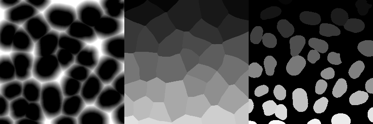

# Closest object in image
For several workflows, it might be interesting to know object is the closest one to each pixel.

This workflow takes the  image of a segmentation results as an input (right image above shows a
nuclear segmentation), and calculates two images of the same size, where each pixel value corresponds to 
1. Distance to the closted object (left image).
2. Index of clostest object (central image).

With these two images, question about proximity can be answered: for each position in the image, the closest
object and the distance to this object can now be easily identified. 

In the **example data**, you can find processed images for the nuclei segmentation: example_data\analysis\segmentation-nuclei-closest.

## Workflows
To **calculate these images** for all masks in a folder, you can use either

* **ImJoy plugin**:  `ObjectDist`, which you  
<a href="https://imjoy.io/#/app?w=fq-segmentation&plugin=fish-quant/segmentation:ObjectDist@stable&upgrade=1" target="_blank">**install from here.**</a>
* **Jupyter notebook**: notebooks\distance-closest-object.ipynb

In either case, the following **parameters** have to be specified

Option           | Type |  Description
---------------- | ---- |  -----------
`Path DATA`    | str  | Full path to folder containing data to be analyzed.
`String label`    | str  |  Unique string identified the mask image that you want to analyze, e.g. `mask__nuclei__`
`String save`    | tuple  | Pair of strings defining the names under which the images with the index of the object, and the distance to this object will be saved, e.g. `('nuclei_close_ind__', 'nuclei_close_dist__')`
`Trunc distance`    | int  | Threshold above which distances will be clipped. 
`Path SAVE`    | str  | Full path to folder where results should be save. If fodler does not exist, it will be created. If no folder is defined, results will be saved in data folder. 
