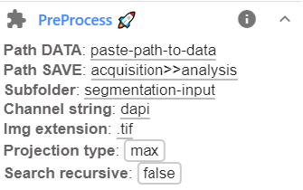

# Preprocessing
Segmentation is done on 2D images. In this step, 3D images are transformed into
2D images by applying a projection, and these images are stored in a separate folder.

Preprocessing is done with the ImJoy plugin `PreProcess`:  
<a href="https://imjoy.io/#/app?w=fq-seg&plugin=fish-quant/segmentation:PreProcess@stable&upgrade=1" target="_blank">**install from here.**</a>

## Defining folder to save results
The plugin allows to define the results folder in two ways

1. Directly define a folder where the results are stored. If the folder doesn't exist, the plugin will rename it. 
2. Define the folder with a text replacement. This option can be useful if many folders are processed (with the optional recursive search), 
    and it allows to automatically create corresponding subfolders. 
    * Such a replacement operation is indicated with a text in the format  `str_orig>>str_new`,
      where 'str_orig' is the orginal string, 'str_new' is the new string.
    * For the example data, using the string `acquisition>>analysis` would imply that you take the folder name,
      e.g. `D:\example_data\acquisition`, and replace `acquisition` with `analysis`, yielding 
      `D:\example_data\analysis`. 
    * The results wil then be saved in subfolder `segmentation-input`. So the projection will be saved in the folder `D:\example_data\analysis\segmentation-input`

## Running the plugin
1. Before running the plugin, you have to specify a few parameters. Note that you have to perform this 
   projection for each channel-type. This allows to use different projection methods for a channel. This can be set in the plugin interface, avaible after clicking on the arrow down next to the plugin name.

    

    Here the following parameters can be set. 

    Option           | Type | Default     | Description
    ---------------- | ---- | ----------- | -----------
    `Path DATA`    | str  |  | Full path to folder containing data to be segmented.
    `Path SAVE` | str  |  | Full path to folder where results should be stored. Or string to defined path by a replacement operation (more details above).
    `Channel string`    | str  |  dapi | Unique string to identify channel that should be processed.
    `Img extension`    | str  |  .tif | Extensions of images to be loaded.
    `Projection type`    | str  |  mean | Different projection types: `max`, `mean`, `indiv`. The option `indiv` implies that a z-stack is split into individual slices, stored in subfolder for each image. 
    `Search recursive`    | bool  |  false | Should provided folder be search recursively for images (true/false). 

0. Pressing the button `PreProcess` will **start the pre-processing**. Progress 
    can be monitored in the plugin log, available by pressing on the `i` next to the plugin name.

0. **Results** will be saved in the specified folder. For each image a json file with 
    basic properties of the file, and an image with the same name as the original one will be saved. 

