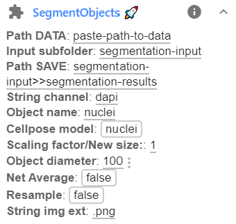
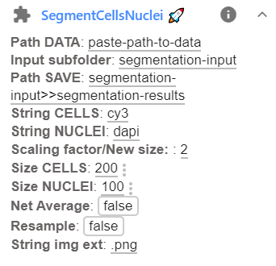

We provide different plugins for different segmentation tasks

* Segment cells OR nuclei with the Plugin `SegmentCellsNuclei`: <a href="https://imjoy.io/#/app?w=fq-seg&plugin=fish-quant/segmentation:SegmentObjects@stable&upgrade=1" target="_blank">**install from here.**</a>
* Segment cells AND nuclei with the Plugin `SegmentCellsNuclei`: <a href="https://imjoy.io/#/app?w=fq-seg&plugin=fish-quant/segmentation:SegmentCellsNuclei@stable&upgrade=1" target="_blank">**install from here.**</a>

## General behavior

### Recursive search for images
Plugins will search RECURSIVELY in the provided folders for all images fitting the specified criteria, 
and segment them. Results will then be stored in a dedicated subfolder

### Defining folder to save results
The plugin allows to define the results folder in two ways

1. Directly define a folder where the results are stored. If the folder doesn't exist, the plugin will rename it. 
2. Define the folder with a text replacement. This option can be useful if many folders are processed (with the optional recursive search), 
    and it allows to automatically create corresponding subfolders. 
    * Such a replacement operation is indicated with a text in the format  `str_orig>>str_new`,
      where 'str_orig' is the orginal string, 'str_new' is the new string.
    * For the example data, using the string `acquisition>>analysis` would imply that you take the folder name,
      e.g. `D:\example_data\acquisition`, and replace `acquisition` with `analysis`, yielding 
      `D:\example_data\analysis`. 
    * The results wil then be saved in subfolder `segmentation-input`. So the projection will be saved in the folder `D:\example_data\analysis\segmentation-input`

### Results
**Results** will be saved in the specified folder. For each image the following files, results files with different suffices are created: 
  *  `flow_...`: these are the predicted distance maps of CellPose. They are an intermediate result, and
     not needed for most end-users. 
  *  `mask_...`: these contain the actual segmentation results. Each segmented object is a filled 
      object with a constant pixel value. If the images were resized during segmentation, the mask is scaled
      back up to the original image size. The actually obtained (smaller) mask is saved under the name `mask__rescale_...`.  
  *  `segmentation_...`: summary plot showing the input image, the predicted distance map, and the segmented
     objects. This plot is also shown in the interface. 

     

### Resizing to speed up prediction
Segmentation speed depends on the image size. In our experience, resizing the images
can lead to a substantial speed-up. In case you resize the images, we implemented a post-processing
routine that will resize the predicted masks back to the original image size. 

## Segmentation of nuclei OR cells

1. Before running the plugin, you have to specify a few parameters. This can be done in the plugin interface, 
   avaible after clicking on the arrow down next to the plugin name.. 
   
   

   Here the following parameters can be set: 

   Option           | Type | Default     | Description
   ---------------- | ---- | ----------- | -----------
   `Path DATA`    | str  |  | Full path to folder containing data to be segmented.
   `Path SAVE` | str  |  | Full path to folder where results should be stored.
   `Object name`    | str  |  nuclei | How the object is called.
   `String channel`    | str  |  dapi | Unique identifier to .
   `String img ext`     | str  | .png | File extension of images that should be segmented.
   `Size object`     | int  | 50 | Typical size of a cell (in resized image).
   `Cellpose model`    | str  |  nuclei | Cellpose model for segmentation: `cyto` or `nuclei`. Note that for dense nuclei, the cytoplasmic model might work better. 
   `New size`     | str  | 512, 512 | String to specify new size of image. No resizing if empty.

2. Pressing on the plugin name `SegmentObjects` will start the segmentation. 
    When using CellPose for the first time, the models for nuclear and cytoplasmic segmentations are downloaded. 
   
    The actual segmentation can take a while, depending on the numberof images that should be segmented 
    (and their size). Progress will be displayed in the ImJoy status bar, and more details provided in the
    plugin log available by pressing on the `i` next to the plugin name. 

    Once a image is segmented, the results will be saved (see below). So you can monitor the result folder 
    to verify on the fly if the segmentation works. 

## Segmentation of cells and nuclei

1. Before running the plugin, you have to specify a few parameters. This can be done in the plugin interface, 
   avaible after clicking on the arrow down next to the plugin name.. 
   
   

   Here the following parameters can be set: 

   Option           | Type | Default     | Description
   ---------------- | ---- | ----------- | -----------
   `Path DATA`    | str  |  | Full path to folder containing data to be segmented.
   `Path SAVE` | str  |  | Full path to folder where results should be stored.
   `String CELLS`    | str  |  cy3 | Unique identifier for images of cytoplasmic stain.
   `String NUCLEI`    | str  |  dapi | Unique identifier for images of nuclear stain.
   `String img ext`     | str  | .png | File extension of images that should be segmented.
   `Size CELLS`     | int  | 100 | Typical size of a cell (in resized image).
   `Size NUCLEI`     | int  | 50 | Typical size of a nucleus (in resized image).
   `New size`     | str  | 512, 512 | String to specify new size of image. No resizing if empty.

2. Pressing on the plugin name `SegmentCellsNuclei` will start the segmentation. 
    When using CellPose for the first time, the models for nuclear and cytoplasmic segmentations are downloaded. 
   
    The actual segmentation can take a while, depending on the numberof images that should be segmented 
    (and their size). Progress will be displayed in the ImJoy status bar, and more details provided in the
    plugin log available by pressing on the `i` next to the plugin name. 

    Once a image is segmented, the results will be saved (see below). So you can monitor the result folder 
    to verify on the fly if the segmentation works. 
