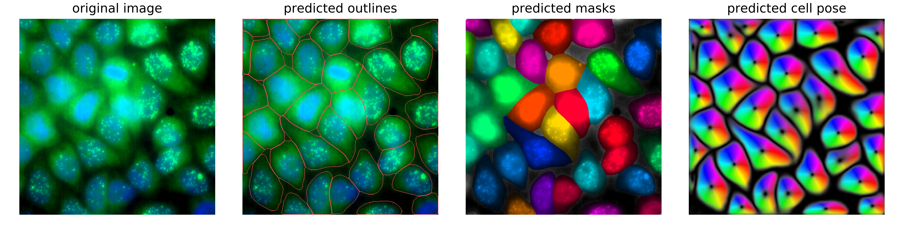

This repository provides wrapper code to use the generalist cell/nuclei segmentation package [**Cellpose**](https://github.com/mouseland/cellpose). 

In the other **overview sections** below we describe

* How to install the **tools** needed for this analysis. 
* How to organize the **data**.

Example of **nuclear segmentation**:

Example of **cytoplasmic segmentation**:

You can then find a **detailed description of each workflow** in dedicated sections accessible from the menu above.  

