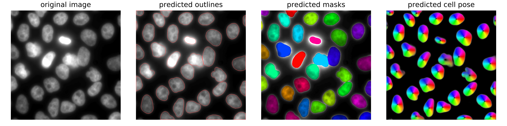

# Segmentation with ImJoy and Cellpose

This repository provides convience wrapper code for the **segmentation of cells and nuclei**. 

__How to get started:__

1. Read this documentation.
2. Install the ImJoy plugin engine (we explain what this is just a bit further down).
3. Install the FISH-quant plugins.
4. Try to analyze the provided test data.
   
!!! example "Example of **nuclear segmentation** and **cytoplasmic segmentation**"
    
    

## Python? ImJoy? Plugin engine?

For new users it might be a bit confusing how the different software packages work together. We hence provide here a small overview of hwo the different pieces work together.

There are **three essential parts**:

{: style="width:500px"}

1. **Python**: code performing the actual analysis in two essential parts
    * The actual **segmentation** is performed with the [**Cellpose package**](https://github.com/mouseland/cellpose).
    * Additional code to pre/post process images, and perform batch processing:
        * We provide **convenient wrappers** to apply this approach in batch mode to a large number of images.
        * We provide **pre- and post-processing** routines to prepare images for segmentation and extract further information, e.g. distance measurements for objects.  

2. **ImJoy**: ImJoy is a plugin powered computing platform to deploy advanced image analysis tools. Here, we provide as a set of such plugins. Plugins can be installed with a simple installation link. More details about ImJoy and how it can be installed, can be found in the decicated overview section.
3. **Plugin Engine**: the ImJoy app is running in your webbrowser (prefereably Chrome). In order to perform computations, you have to install a 
so-called plugin engine. ImJoy can connect to such an engine, and launch data processing tasks. Importantly, this engine can run locally or remotely, but the ImJoy interface will always be the same. YOu have to install this engine once. Each time you want to use FISH-quant, you have to launch it and connect ImJoy to this engine.

