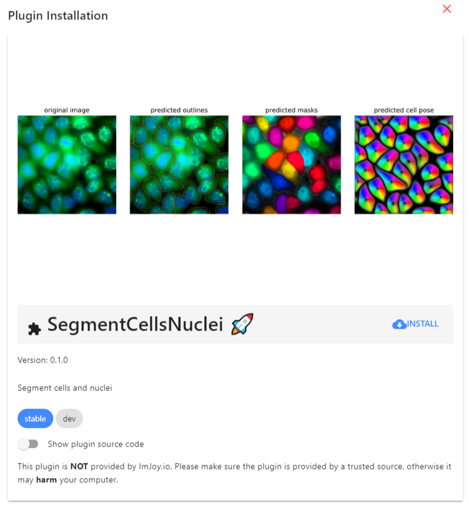

# Tools
Here, we describe the different software packages that are used.

We provide for all analysis workflows dedicated **ImJoy plugins**, to faciliate their use. 
The ImJoy plugins are build on Python and require that you connect to a Jupyter Notebook. 
Once you followed the instructions below you can connect ImJoy to a Jupyter notebook with:

1. **Activate the environment**: `conda activate cellpose`
2. **Start Jupyter notebook**: `jupyter notebook --NotebookApp.allow_origin='*' --no-browser`
3. Copy the provided URL including the token, in ImJoy connect to this Jupyter notebook. 

We also provide Python source code illustrating the basic usage in the folder `workflows`.

A more detailed description of each workflow is provided in the dedicated sections. 


## Installation
In order to use the workflows in this repository, you need to follows these steps, which we detail below: 

1. Install **Python** , recommended with Miniconda:
0. Create a **dedicated environment** with Jupyter to run your code.
0. Install the plugins for the workflows of interest. 

### Miniconda with Python
We recommend installing an [Miniconda distribution of Python](https://docs.conda.io/en/latest/miniconda.html): choose Python 3.7 and your operating system. You  can then use the annoconda prompt to excecute the different commands listed below. 

### Conda environment for Cellpose
We recommend creating a dedicated environment to run Cellpose. This guarantess that only necessary code is installed. 
To create an environment called `cellpose`, open an anaconda prompt and type. Note that you will also install 
jupyter, which will allow to run the jupyter notebooks for easier execution (confirm with `y` when asked if you want to proceed: 

```
conda create --name cellpose python=3.7 jupyter
```

To activate the `cellpose` environment type (Note you will always have to run this command when using this workflow):
```
conda activate cellpose
```

## ImJoy
[**ImJoy**](https://imjoy.io/docs/#/) is image processing platform with an easy
 to use interface. ImJoy can be used directly in your browser, without any prior installation. 

 While ImJoy is an app running in the browser, **NO** user data will be transferred over the internet. 
 
 Some important **features**:

 2. Specific functionality is provided by plugins, which can be installed with simple links. Available 
    plugins are listed in the plugin list on the left part of the interface. Depending on the implementation 
    plugins are either executed directly by pressing on their name, or a simple interface can be displayed when
    pressing on the arrow down symbol. 
 3. ImJoy can have several workspaces. Each workspace can contain multiple plugins and is often
    dedicated to a specific data processing task. Workspaces can be selected from little puzzle symbol in the upper left part of the interface.
 
    


### Installing plugins
We provide links to install the different ImJoy plugins. These installation links also specify
in which **ImJoy workspaces** the plugin will be installed  

If you press on the installation link, the ImJoy web app will open and display a
dialog asking if you want to install the specified plugin. To confirm, press the `install` button.



Once installed, ImJoy remembers the workspaces and plugins and you simply have to
open the ImJoy app and select the workspace (which will be `cellpose`): [https://imjoy.io/#/app](https://imjoy.io/#/app)

### Running Python plugins 
Most of the provided plugins use Python for the processing. In order for ImJoy these plugins, you have 
to connect ImJoy to a **Jupyter notebook server**, which can be installed via Miniconda. Please note
that this "server" can run on your local machine, so no data-transfer over the internet is taking place. 
    
Once you have the computational environment set up (see Installation), you start an Jupyter Notebook, 
to which ImJoy can connect: 

1. **Activate the environment**:
    ```
    conda activate cellpose
    ```
2. **Start Jupyter notebook**. Type
    ```
    jupyter notebook --NotebookApp.allow_origin='*' --no-browser
    ```
    Copy the provided URL including the token, something like `http://127.0.0.1:8889/?token=16126ce8b02ee35103200c46d71b3f946bfb408d1cae0f68`
3. In ImJoy, press on the rocket symbol in the upper right corner, select `Add Jupyter-Engine` 
    and past the URL from the step above. 
4. You can now connect your plugin to this Juypyter Kernel, by clicking on the puzzle symbol 
    next to the plugin name, and selecting the Juypyter Notebook as engine.  


## Jupyter notebooks 
We also illustrate the workflow in the ImJoy Python plugins in dedicated Jupyter notebooks, which can 
be found in the folder `notebooks`. 

To run this code, we recommend following the instructions above to create a dedicated conda environment, 
and install the code of this plugin in this env, e.g. with 
```
pip install git+https://github.com/muellerflorian/segmentation/ --upgrade
```