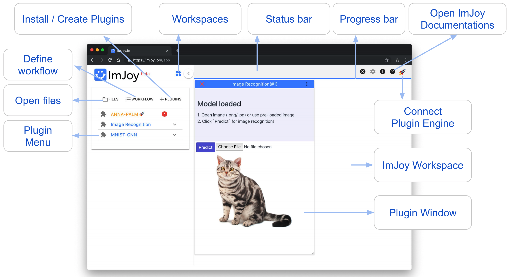

# Tools
Here, we describe the different software packages that are used, and how to install them.

* Most tasks are performed by **Python plugins running in ImJoy**, and described in the section [**ImJoy analysis**](imjoy-overview.md).
* For less frequently tasks, we provide some explanations in  [**Diverse workflows**](diverse-workflows-overview.md).

A detailed description of each analysis workflow is provided in the dedicated sections. 

## Summary
Here, you find a brief summary of the installation steps detailed in the sections below.

* The analysis workflows are provided as dedicated **ImJoy plugins**. 
* Once the plugin are installed in ImJoy, you can access them in a dedicated **workspace** `fq-segment`. 
* To use the plugins them you have to connect to the **Jupyter engine**
  
    1. **Activate the environment**: 
        ```
        conda activate cellpose
        ```
    2. **Start Jupyter notebook**: 
       ```
       jupyter notebook --NotebookApp.allow_origin='*' --no-browser
       ```
    3. Copy the provided URL including the token. In ImJoy connect to this Jupyter notebook. 

## Installation
In order to use the workflows in this repository, you need to follows these steps, which we detail below: 

1. Install **Python** , recommended with Miniconda:
0. Create a **dedicated environment** with Jupyter to run your code.
0. Install the plugins for the workflows of interest. 

## Python with Miniconda
We recommend installing an [Miniconda distribution of Python](https://docs.conda.io/en/latest/miniconda.html): choose Python 3.7 and your operating system. You  can then use the annoconda prompt to excecute the different commands listed below. 

We also recommend creating a dedicated environment to run the code in this package. This guarantess that only necessary code is installed. 
To create an environment called `cellpose`, open an anaconda prompt and type. Note that you will also install 
Jupyter, which will allow to run the Python plugins in ImJoy. Confirm with `y` when asked if you want to proceed (`Proceed ([y]/n)?`): 

```
conda create --name cellpose python=3.7 jupyter
```

## ImJoy
[**ImJoy**](https://imjoy.io/docs/#/) is image processing platform with an easy
 to use interface. ImJoy can be used directly in your browser, without any prior installation. 

 While ImJoy is an app running in the browser, **NO** user data will be transferred over the internet. 
 
 Some important **features**:

 2. Specific functionality is provided by plugins, which can be installed with simple links. Available 
    plugins are listed in the plugin list on the left part of the interface. Depending on the implementation 
    plugins are either executed directly by pressing on their name, or a simple interface can be displayed when
    pressing on the arrow down symbol. 
 3. ImJoy can have several workspaces. Each workspace can contain multiple plugins and is often
    dedicated to a specific data processing task. Workspaces can be selected from little puzzle symbol in the upper left part of the interface.
 
    


### Installing plugins
We provide links to install the different ImJoy plugins. These installation links also specify
in which **ImJoy workspaces** the plugin will be installed  

If you press on the installation link, the ImJoy web app will open and display a
dialog asking if you want to install the specified plugin. To confirm, press the `install` button.


Once a plugin is installed, ImJoy remembers the workspaces and plugins it contains. 
If you want to redo an analysis, you simply have to open the [ImJoy app](https://imjoy.io/#/app)and select the appropriate (`fq-segment` for this package) 


### Running Python plugins 
Most of the provided plugins use Python for data processing. To use these plugins, you have 
to connect ImJoy to a **Jupyter notebook**, which can be installed via Miniconda (see section about Python Installation [above](#python-with-miniconda). Please note
that this "notebook" runs on your local machine, so no data-transfer over the internet is taking place. 
    
Once you have the computational environment set up (see Installation), you start an Jupyter Notebook, 
to which ImJoy can connect: 


1. **Activate the environment**:
    ```
    conda activate cellpose
    ```
0. **Start Jupyter notebook**. Type
    ```
    jupyter notebook --NotebookApp.allow_origin='*' --no-browser
    ```
    Copy the provided URL including the token, something like `http://127.0.0.1:8889/?token=16126ce8b02ee35103200c46d71b3f946bfb408d1cae0f68`
0. To **connect ImJoy to the notebook**, 
   
    1. go to the ImJoy app and press on the rocket symbol in the upper right corner, 
       select `Add Jupyter-Engine` and paste the URL from the step above. 
    2. Plugins will then be automatically **connected to this Jupyter Kernel**. You can verify this, 
       by clicking on the puzzle symbol next to the plugin name. Depending on the plugin, installation
       might take a while, during this period the plugin name will be in red.  

     


## Jupyter notebooks 
We also illustrate the workflow in the ImJoy Python plugins in dedicated Jupyter notebooks, which can 
be found in the folder `notebooks`. 

To run this code, we recommend following the instructions above to create a dedicated conda environment, 
and install the code of this plugin in this env, e.g. with 
```
pip install git+https://github.com/fish-quant/segmentation --upgrade
```