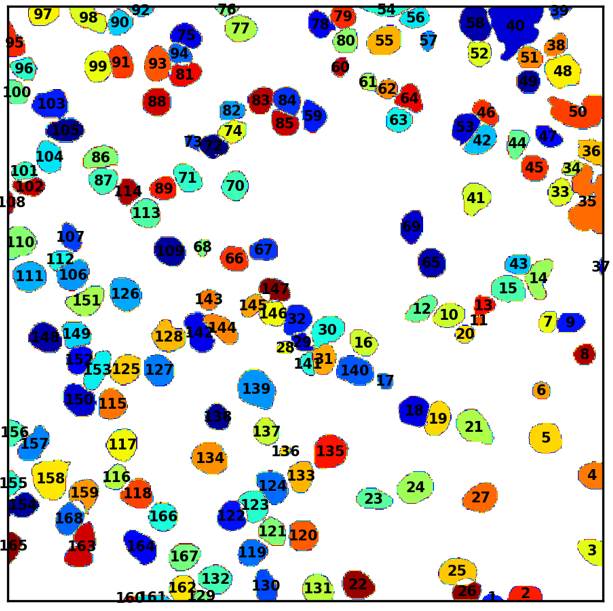

# Numbered label image

Segmentation results in a filled mask for each segmented object (cell or nucleus). Each mask has a unique integer value (0 is reserved for background). This value can be used to uniquely identify each object. An inspection of the resulting label image is possible in any image processing tool, such as FIJI. However, for convience, it might also be useful to have an overview image showing all labels, such as the one shown below

After segmentation, each object (cell or nucleus) has a unique id.
 

This workflow permits to create such an image from any label image created by the segmentation workflow.

You can install the plugin from <a href="https://imjoy.io/#/app?w=fq-segmentation&plugin=fish-quant/fq-segmentation:CreateNumberedLabels@stable&upgrade=1" target="_blank">**here.**</a>

## Workflow

The default settings of the plugins allow to quickly perform the recommended workflow. You only have 
to paste the path to folder containing the segmentation results (usually a folder called `segmentation-results`). The plugin will then loop over all files in this folder, and select the onces fitting the other two parameters:

- `File string`: specify a string that the file-name has to contain. The default `mask__` fits for both segmentation of cells and nuclei. 
- `Img extension: file-extension of the label images. The default is `.png`, which is the extension used by our segmentation pipeline.

The plugin will then create a new subfolder called `labels_numbered` where the numbered label images 
will be stored under their original file-name with an added suffix `__numbered.png`.