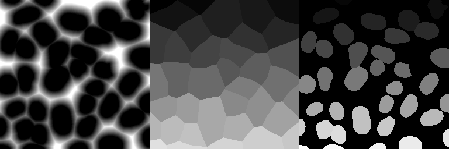

# Closest object in image

For several workflows, it might be interesting to know the object that is the closest each pixel in the.

This workflow takes the  image of a segmentation results as an input (right image above shows a
nuclear segmentation), and calculates two images of the same size, where each pixel value corresponds to 

1. Distance to the closted object (left image).
2. Index of clostest object (central image).

With these two images, question about proximity can be answered: for each position in the image, the closest
object and the distance to this object can now be easily identified.

In the **example data**, you can find processed images for the nuclei segmentation: `example_data\analysis\distance-maps`.

## Recommended workflow

The default settings of the plugins allow to quickly perform the recommended workflow. You only have 
to paste your data folder.  

1. Segmentation results are stored `segmentation-input`
2. In the pre-processing step, the folder to save data is obtained with 
    
    1. the text replacement `segmentation-results˃˃distance-maps`.
    2. Images are stored in a new subfolder `segmentation-input`
    
    With these options, the images will be saved in a folder `distance-maps`.

## Implementations

To **calculate these images** for all masks in a folder, you can use either

* **Jupyter notebook**: notebooks\distance-closest-object.ipynb
* **ImJoy plugin**:  `ObjectDist`, which you  
<a href="https://imjoy.io/#/app?w=fq-segmentation&plugin=fish-quant/fq-segmentation:ObjectDist@stable&upgrade=1" target="_blank">**install from here.**</a>

In either case, the following **parameters** have to be specified

Option           | Type |  Description
---------------- | ---- |  -----------
`Path DATA`    | str  | Full path to folder containing data to be analyzed.
`String label`    | str  |  Unique string identified the mask image that you want to analyze, e.g. `mask__nuclei__`
`String save`    | tuple  | Pair of strings defining the names under which the images with the index of the object, and the distance to this object will be saved, e.g. `('nuclei_close_ind__', 'nuclei_close_dist__')`
`Trunc distance`    | int  | Threshold above which distances will be clipped.
`Path SAVE`    | str  |  Several options exist. See dedicated section here [below](data.md#specify-folder-to-save-your-data) for more details.
`Search recursive`    | bool  | Should provided folder be search [**recursively**](analysis-general-behavior.md#recursive-search-for-data) for images (true/false).
