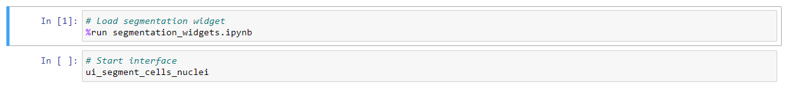
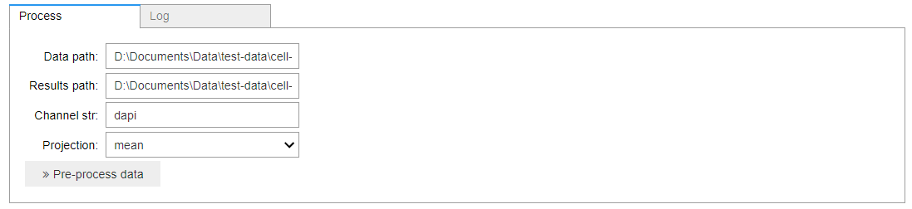
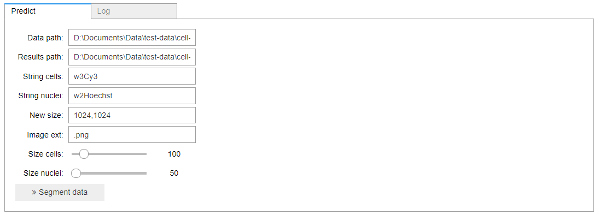
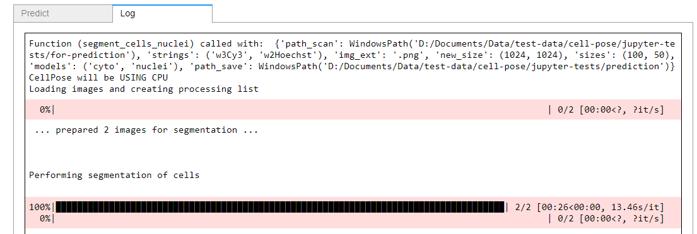
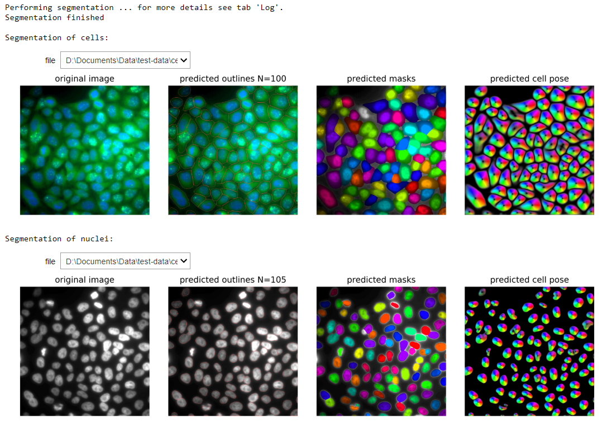
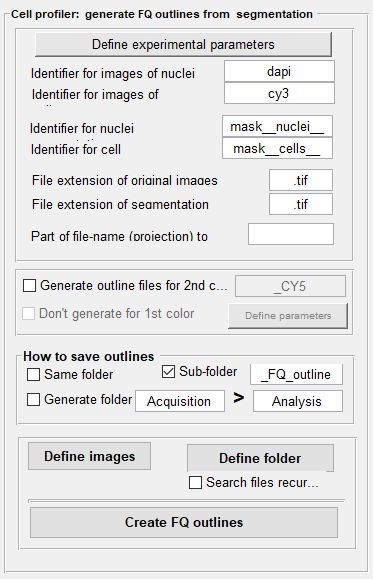

# Overview
This repository provides wrapper code to use the generalist cell/nuclei segmentation package [**Cellpose**](https://github.com/mouseland/cellpose). 

Two main functionalities are provided:
1. Prepare z-stacks for segmentation by performing z-stack projections.
2. Provide convenient interface to batch segment a large number of images.


- [Overview](#overview)
- [Installation](#installation)
  - [Pyton with Miniconda](#pyton-with-miniconda)
  - [Create dedicated environment to run Cellpose](#create-dedicated-environment-to-run-cellpose)
  - [Installing cellpose](#installing-cellpose)
  - [Installing this package](#installing-this-package)
- [Data](#data)
  - [Data organization](#data-organization)
  - [Test data](#test-data)
- [Usage](#usage)
  - [Resizing to speed up prediction.](#resizing-to-speed-up-prediction)
  - [Working with Jupyter notebooks](#working-with-jupyter-notebooks)
  - [Preprocessing](#preprocessing)
  - [Performing segmentation of cells and nuclei](#performing-segmentation-of-cells-and-nuclei)
  - [Post-processing](#post-processing)
    - [Create FISH-quant [Matlab] outline files](#create-fish-quant-matlab-outline-files)


# Installation
The installation consists of the following steps

1. **Python**. Recommended with Miniconda:
0. Create a **dedicated environment** with Jupyter to run your code
0. Install **Jupyter lab** to run your code interactively.
0. Install **CellPose**
0. Install our code to provide wrappers to easily use CellPose.  
   

## Pyton with Miniconda
We recommend installing an [Miniconda distribution of Python](https://docs.conda.io/en/latest/miniconda.html): choose Python 3.7 and your operating system. 

We then recommend using the annoconda prompt that is availabel to excecute the different commands listed below. 
This guarantees that the necessary terminal scripts are available. 

## Create dedicated environment to run Cellpose
We recommend creating a dedicated environment to run Cellpose. To create an environment called `cellpose`, open an anaconda prompt and type. Note that you will also install jupyter, which will allow 
to run the jupyter notebooks for easier execution (confirm with `y` when asked if you want to proceed): 

```
conda create --name cellpose python=3.7 jupyter
```

Then activate your environment (Note you will always have to run conda activate cellpose before you run cellpose):
```
conda activate cellpose
```


## Installing cellpose
From your `cellpose` environment, install Cellpose and its dependencies with
```
pip install cellpose  --upgrade
```

## Installing this package
TODO create setup.py

From your `cellpose` environment, install this package its dependencies with
TODO: update to master branch once committed.
```
pip install git+https://github.com/muellerflorian/segmentation/develop --upgrade
```

# Data

## Data organization
We strongly recommend the following data-organization on which this workflow has been tested.
1. Images are store as single-channel multi-z-stack tif files, e.g on tif per position and channel.
2. All raw 3D images are stored in a folder `acquisition`
3. All analysis results are stored in subfolder `analysis`, where each analysis step has a separate subfolder.

The organization of the provided test data is the following

```
├─ example_data/
│  ├─ acquisition                          # Folder with raw data
│  │  ├─ test_pos001_cy3.tif
│  │  ├─ test_pos002_dapi.tif
│  │  ├─ test_pos002_cy3.tif
│  │  ├─ test_pos002_dapi.tif
│  ├─ analysis                              # Folder with all analysis results
│  │  ├─ segmentation-input                 # Folder with projected images for segmentation 
│  │  │  ├─ img-prop__test_pos001_cy3.json  # json file with image properties
│  │  │  ├─ test_pos001_cy3.png             # Projected image
│  │  │  ├─ ....
│  │  ├─ segmentation-results               # Folder with segmentation results 
│  │  │  ├─ test_pos001_cy3.tif
│  │  │  ├─ test_pos001_cy3.tif
│  │  │  ├─ test_pos001_cy3.tif
│  │  │  ├─ ....
│  │  ├─ ....
│  │  ├─ FQ_outline                         # [Optional] FQ outlines 
│  │  │  ├─ test_pos001_cy3_outline.txt
│  │  │  ├─ ....

```

## Test data

# Usage

## Resizing to speed up prediction. 
Segmentation speed depends on the image size. In our experience, resizing the images
can lead to a substantial speed-up. In case you resize the images, we implemented a post-processing
routine that will resize the predicted masks back to the original image size. 

## Working with Jupyter notebooks
Jupyter notebooks provide a convenient way to execute code with minimal user input. 
We further provide notebooks with interactive control, to faciliate ussage. 

Code is divided into code-cells (two in the example below). 
The currently enabled cell (the first one in the example below) is shown with a blue frame. 
It can be execude by pressing `SHIFT+ENTER`




## Preprocessing
Segmentation is done on 2D images. In this step, 3D images are transformed into
2D images by applying a projection. 

This is done with the jupyter notebook `preprocessing.ipynb`

1. Running the first code cell will import the user-interface.
   
2. Running the second code cell will display the user-interface. 
   
   Note that you have to perform this projection for each channel-type. This allows
   to use different projection methods for a channel.

   Here the following parameters can be set: 

    

    Option           | Type | Default     | Description
    ---------------- | ---- | ----------- | -----------
    `Data path`    | str  |  | Full path to folder containing data to be segmented.
    `Results path` | str  |  | Full path to folder where results should be stored.
    `Channel str`    | str  |  dapi | Unique string to identify channel that should be processed.
    `Projection`    | str  |  mean | Different projection types: mean, max, indiv. Indiv implies that z-stack is split into individual slices. 


3. Pressing the button `Pre-process data` will start the segpre-processing. Progress 
    can be monitored in the tab `Log`.

4. Once the segmentation is finished, results can be inspected in the lower part of the interface. 
   The dropdown menus allow to inspect the results for cell and nuclear segmentation. 

    


5. **Results** will be saved in the specified folder. For each image a json file with 
    basic properties of the file, and an image with the same name as the original one will be saved. 


## Performing segmentation of cells and nuclei
This is done with the jupyter notebook `segmentation_cells_nuclei.ipynb`

1. Running the first code cell will import the user-interface.
   
2. Running the second code cell will display the user-interface. 
   Here the following parameters can be set: 

    

    Option           | Type | Default     | Description
    ---------------- | ---- | ----------- | -----------
    `Data path`    | str  |  | Full path to folder containing data to be segmented.
    `Results path` | str  |  | Full path to folder where results should be stored.
    `String cells`    | str  |  cy3 | Unique identifier for images of cytoplasmic stain.
    `String nuclei`    | str  |  dapi | Unique identifier for images of nuclear stain.
    `New size`     | str  | 512, 512 | String to specify new size of image. No resizing if empty.
    `Image ext`     | str  | .png | File extension of images that should be segmented.
    `Size cells`     | int  | 100 | Typical size of a cell (in resized image).
    `Size nuclei`     | int  | 50 | Typical size of a nucleus (in resized image).

3. Pressing the button `Segment data` will start the segmentation. When using CellPose for the first time, 
   the models for nuclear and cytoplasmic segmentations are downloaded. 
   
   The actual segmentation can take a while, depending on the numberof images that should be segmented 
   (and their size). Progress can be monitored in the tab `Log`.

    

4. Once the segmentation is finished, results can be inspected in the lower part of the interface. 
   The dropdown menus allow to inspect the results for cell and nuclear segmentation. 

     
   
5. **Results** will be saved in the specified folder. For each image the following files, results files 
    with different suffices are created: 
    *  `flow_...`: these are the predicted distance maps of CellPose. They are an intermediate result, and
       not needed for most end-users. 
    *  `mask_...`: these contain the actual segmentation results. Each segmented cell or nuclei is a filled 
        object with a constant pixel value. If the images were resized during segmentation, the mask is scaled
        back up to the original image size. The actually obtained (smaller) mask is saved under the name `mask__rescale_...`.  
    *  `segmentation_...`: summary plot showing the input image, the predicted distance map, and the segmented
       objects. This plot is also shown in the interface. 


## Post-processing

### Create FISH-quant [Matlab] outline files
In order to use the segmentation results in the Matlab version of FISH-quant, 
FISH-quant outline files have to be created from the mask images. 

For this, we provide a Matlab GUI distributed with the [FISH-quant package](https://bitbucket.org/muellerflorian/fish_quant/src/master/). After installing FISH-quant, you can open this GUI from the command window
with `FQ_seg`. The relevant part of the interface is the central panel _Cell Profiler: generate FQ outlines from segmentation_. 




1. **Specify experimental parameters**. These parameters have to be defined – even if the default parameters are good. 
   Only then the button to generate the outlines will be enabled. 

0. **Define naming scheme of original images and segmentation results**. You have to define a few parameters regarding 
   the naming convention of your files. 
    1. Unique identifier for the FISH and DAPI images. These identifiers have to be defined in a way that when you take the 
       full file-name of the FISH image and you replace the identifier for FISH, e.g. `cy3`, by the identifier of the DAPI, e.g. `dapi`, you obtain the DAPI file-name. 
    2. Then, you have to define the identifier of your segmentation results. For this workflow, `mask__nuclei__` for the nuclei and
       `mask__cells__` for the cells. 
    3. File-extensions of the masks and original file-names, e.g. `tif` for the example data. 
   
0. [Optional] Generating outline files for a second color. This option allows to generate outline files for a second color,
    e.g. for a dual-color FISH experiment or if the cell segmentation was performed with a different channel than the FISH channel. The outlines for this color will be based on the segmentation results of the first color and the exact cells will be used. This allows a simple comparison between the detection results. As above, the identifier for the second color has to be specified, e.g. `cy5`. You also have to redefine the experimental parameters (most often to adjust the excitation and emission wavelength). 

    Additionally, you can choose to not create the outlines for the channel that was used for cell segmentation. This option is useful if the first color does not contain actual smFISH data but results of a dedicated cell segmentation stain. 

0. Several options exist to **specify the folder** where the results will be saved. By default, the FQ outlines will be stored
   in a sub-folder `__FQ_outlines` within the folder containing the segmentation results. You can then move it to another location, e.g. directly into the `analysis` folder as done for the example data. 

0. Specify images that will be analyzed. You can either choose different images that you want to analyze (`Define images`), 
   or select an entire folder (`Select folder`). For the latter, you can also specify a recursive search; this means that all subfolders will be searched as well (not recommended for this workflow). The script will only consider images that follow the above explained naming convention – other images will be ignored. 

0. **Create outlines**. Lastly, press the button `Create FQ outlines`. The script will then automatically search for the files
   describing the segmentation of cells and nuclei. For each image an outline file with the reference to the ORIGINAL 3D image will be generated and nuclei assigned to their respective cells. 